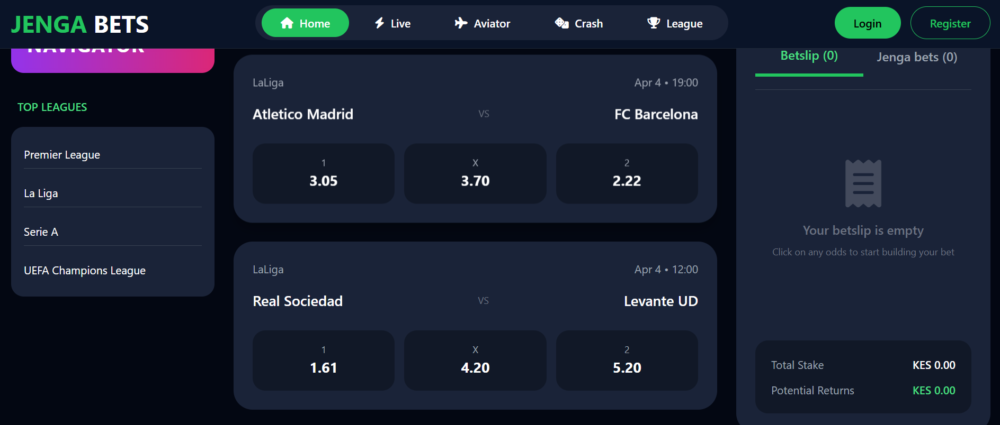
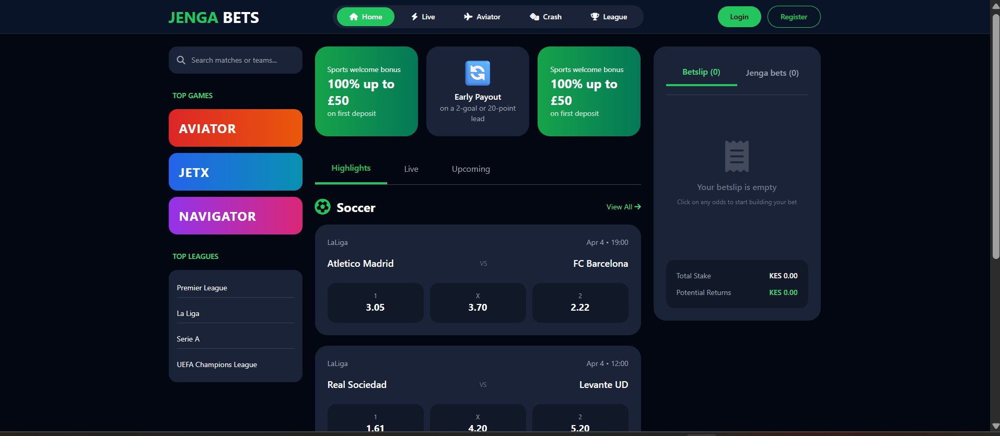

# 🎯 Jengabet — Sports & Betting Platform

<p align="center">
  
</p>

<p align="center">
  <strong>A modern, responsive sports and betting platform interface.</strong>
</p>

<p align="center">
  <a href="https://michaelmwangiwaweru.github.io/jengabet/">🌐 Live Demo</a>
  &nbsp; • &nbsp;
  <a href="https://github.com/michaelmwangiwaweru/jengabet">💻 GitHub Repository</a>
</p>

---

## 📌 Project Overview

**Jengabet** is a modern web-based sports and betting platform interface designed to provide users with an engaging and easy-to-navigate experience.

The project focuses on presenting sports information, league content, promotional sections, and betting-related interfaces through a clean and responsive web design.

The website was developed as a practical frontend project demonstrating modern web development, responsive design, user interface development, and multimedia integration.

---

## 🖥️ Website Preview

### 🏠 Landing Page

<p align="center">
  
</p>

The landing page provides users with an immediate overview of the platform and its available sports-related content.

---

### 🏆 Top League Section

<p align="center">
  
</p>

The league section presents sports and league information in a visually organized format, making it easier for users to explore available competitions.

---

### 📸 Additional Interface

<p align="center">
  
</p>

Additional interface components demonstrate the overall layout, styling, and responsive presentation of the platform.

---

## ✨ Key Features

* 🏠 Modern landing page
* 🏆 Sports league presentation
* ⚽ Sports-focused interface
* 📱 Responsive web design
* 🎨 Modern and engaging user interface
* 🖼️ Image and multimedia integration
* 🧭 Easy navigation
* 🚀 GitHub Pages deployment
* ⚡ Lightweight static website

---

## 🛠️ Technologies Used

| Technology   | Purpose                       |
| ------------ | ----------------------------- |
| HTML5        | Website structure             |
| CSS3         | Styling and responsive design |
| JavaScript   | Interactive functionality     |
| Git          | Version control               |
| GitHub       | Source code hosting           |
| GitHub Pages | Website deployment            |

---

## 📂 Project Structure

```text
jengabet/
│
├── index.html
├── favicon.ico
├── landpagedemo.png
├── topleague.png
├── Screenshot 2026-10-01 182729.png
└── README.md
```

---

## 🌐 Live Website

The project is deployed using GitHub Pages.

### 👉 Visit the live website

**https://michaelmwangiwaweru.github.io/jengabet/**

---

## 💻 Run Locally

To run the project locally:

### 1. Clone the repository

```bash
git clone https://github.com/michaelmwangiwaweru/jengabet.git
```

### 2. Open the project

```bash
cd jengabet
```

### 3. Run the website

Open:

```text
index.html
```

in your web browser.

You can also use **Visual Studio Code with Live Server** for local development.

---

## 📸 Screenshots

The project includes screenshots demonstrating the website's interface and visual design.

| Preview                            | Description                  |
| ---------------------------------- | ---------------------------- |
| `landpagedemo.png`                 | Main landing page            |
| `topleague.png`                    | Top league section           |
| `Screenshot 2026-10-01 182729.png` | Additional website interface |

---

## 🎯 Project Goals

The main goals of this project were to:

* Build a professional sports-focused web interface.
* Practice responsive frontend development.
* Create an engaging user experience.
* Organize sports and league information clearly.
* Deploy a real-world project online using GitHub Pages.
* Demonstrate practical web development skills.

---

## 👨‍💻 Developer

### Michael Mwangi Waweru

**Computer Science Graduate | Java & PHP Developer | Data Analyst**

This project demonstrates practical experience in frontend development, web deployment, version control, and user-interface design.

---

## 📄 License

This project is intended for educational, portfolio, and demonstration purposes.

---

<p align="center">
  ⭐ If you find this project useful, consider giving the repository a star.
</p>

<p align="center">
  <strong>Jengabet — Sports. Leagues. Experience.</strong>
</p>
